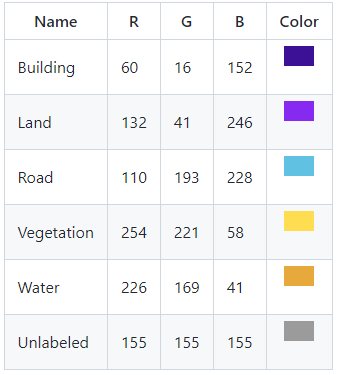
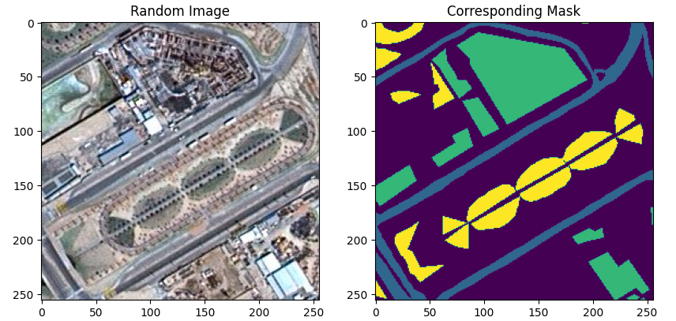
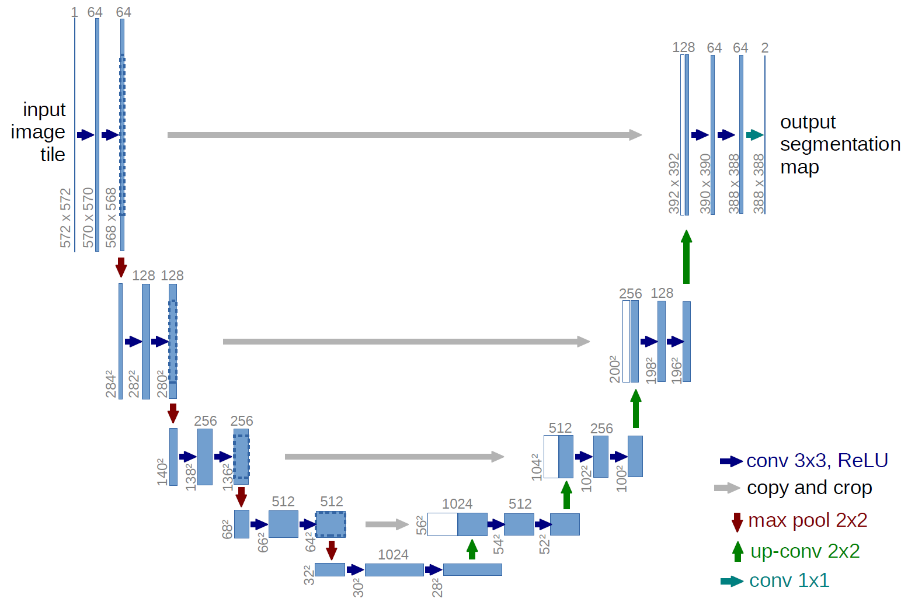
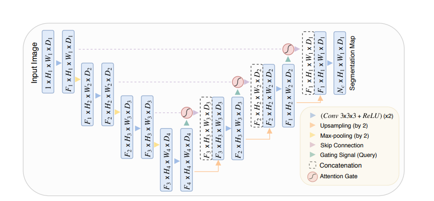
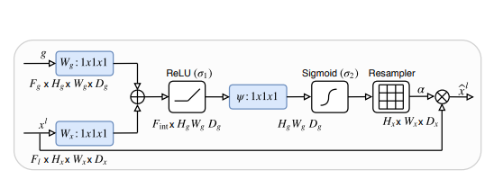
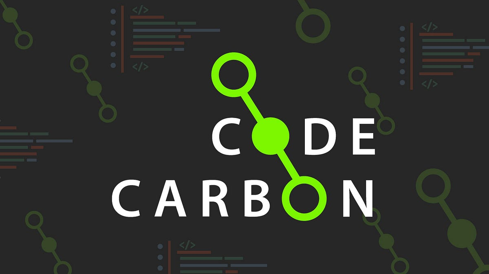

<<<<<<< HEAD


# A Satellite Semantic Segmentation Project with Pytorch using Unet and Attention Unet

#### Note : This work is currently in progress 


### Introduction

The analysis of satellite imagery holds paramount importance across diverse sectors, such as agriculture, urban planning, environmental monitoring, and disaster management. The extraction of meaningful insights from these images is imperative for informed decision-making. Semantic segmentation, a fundamental computer vision task, enables the precise categorization of each pixel within an image, facilitating the accurate identification of objects and features present in the scene.

This project is centered around the segmentation of satellite images, employing advanced deep learning methodologies implemented in PyTorch. Specifically, we utilize two  models: U-Net and Attention U-Net. The importance of segmentation lies in its ability to elevate the interpretability and accuracy of satellite data analysis, enabling applications like land cover classification, infrastructure monitoring, and change detection.

This repository is meticulously structured to ensure reproducibility, allowing fellow researchers and enthusiasts to effortlessly reproduce the results and build upon this work. Your stars are not only appreciated but also serve as a testament to the value this project brings to the community. If you find this repository useful, please consider leaving a star ⭐️ to show your support. 

### Dataset
This project relies on an open access dataset, developed in collaboration between Humans in the Loop and the Mohammed Bin Rashid Space Center (MBRSC) in Dubai, UAE. The dataset comprises aerial imagery of Dubai acquired by MBRSC satellites and is meticulously annotated for pixel-wise semantic segmentation across six distinct classes. Significantly, the segmentation process was undertaken by trainees associated with the Roia Foundation in Syria. This invaluable semantic segmentation dataset is openly shared with the public domain by Humans in the Loop under the CC0 1.0 license, encouraging widespread use for research and development. 

The six classes : 

 

[Access the dataset here](https://www.kaggle.com/datasets/humansintheloop/semantic-segmentation-of-aerial-imagery)

### Sample Images & Masks
 

### Data Augmentation
Data augmentation involves creating variations of the training dataset by applying transformations such as rotation, scaling, and flipping to input images. In the context of image segmentation, the term "mask" refers to the ground truth labels or annotations corresponding to each pixel in the image. Albumentations, a widely-used augmentation library, simplifies the augmentation process by ensuring that the transformations applied to input images are also seamlessly applied to their associated masks, maintaining spatial consistency between the augmented image and its segmentation annotations.
The techniques we employ are :

* ShiftScaleRotate
* RGBShift
* RandomBrightnessContrast
* ColorJitter
* HorizontalFlip
* VerticalFlip

### Models

This project serves as a personal learning journey, aiming to acquire proficiency in constructing model architectures from scratch using PyTorch. 

* The implementation includes U-Net models, which consist of an encoder-decoder structure with skip connections, facilitating the extraction of both global and local features.



For detailed insights into the U-Net architecture, refer to the original article by Ronneberger et al.: [U-Net: Convolutional Networks for Biomedical Image Segmentation](https://arxiv.org/abs/1505.04597)

* Moving on to Attention U-Net, this variant enhances the U-Net model by incorporating attention mechanisms. These mechanisms enable the model to selectively focus on specific regions of interest during the segmentation process, improving accuracy and robustness.





For a comprehensive understanding of Attention U-Net, refer to the relevant article: [Attention U-Net: Learning Where to Look for the Pancreas](https://arxiv.org/abs/1804.03999)

### Losses and Metrics

* `CrossEntropyLoss` with weight is used to evaluate error at each epoch. The weight parameter is used for class imbalance problem and is computed with the function `calculate_class_weights`(more details in utils.py)


* For evaluation metrics I employed torchmetrics library with predefined metrics : 
    * `Accuracy`
         ```math
           \text{Accuracy} = \frac{1}{N}\sum_i^N 1(y_i = \hat{y}_i) 
        ```
        <br />
    ```math
            \text{Where } y \text{ is a tensor of target values, and } \hat{y} \text{ is a tensor of predictions}
    ```

    * `Dice`
        ```math
            \text{Dice} = \frac{\text{2 * TP}}{\text{2 * TP} + \text{FP} + \text{FN}} 
        ```
        <br/>
    ```math 
        \text{Where } TP \text{ and } FP   \text{ represent the number of true positives and
        false positives respecitively.}
    ```

    * `Jaccard index (iou)`
        The `Jaccard index`_ (also known as the intersetion over union or jaccard similarity coefficient) is an statistic that can be used to determine the similarity and diversity of a sample set. It is defined as the size of the intersection divided by the union of the sample sets:

        ```math
            J(A,B) = \frac{|A\cap B|}{|A\cup B|}

        ```


### Training and Validation results


### CO2 Emissions with codecarbon


### How to reproduce the project

* clone the repo :
    - git clone https://github.com/LiganiumInc/Satellite-Semantic-Segmentation.git
* create a virtual environment :
    - python3 -m venv env
    - source env/bin/activate
* install the required packages
    - pip install -r requirements.txt

### List of Interesting libraries used

| Library      | Logo                                                                           | Description |
| :------------|:------------------------------------------------------------------------------:| -----------:|
| Pytorch      |   |             |
| Torchmetrics ||           |
| codecarbon   ||             |

### References


### License
This project is licensed under the MIT License.


 
=======
# Computer-Vision
End-to-end computer vision projects including image classification, medical imaging, object detection, and generative models and othur techniques using PyTorch., built with PyTorch and modern AI technique
# 🖼️ Computer Vision Projects

A comprehensive collection of **Computer Vision projects** built using **Deep Learning** techniques. This repository demonstrates hands-on experience in solving real-world vision problems, with a strong focus on **medical imaging**, **image classification**, **object detection**, and **generative models** and **and outher technique**.

---

## 🚀 Overview

This repository is designed to showcase practical and production-oriented computer vision skills. Each project follows a clean structure, clear documentation, and reproducible experiments, making it suitable for **portfolio presentation**, **CV screening**, and **technical interviews**.

---

## 📂 Repository Structure

```
computer-vision-projects/
│
├── image_classification/
│   ├── cnn_classifier/
│   ├── transfer_learning_resnet/
│
├── medical_imaging/
│   ├── chest_xray_classification/
│   ├── chest_xray_gan/
│
├── generative_models/
│   ├── gan/
│   ├── vae/
│
├── object_detection/
│   ├── yolov5_custom_dataset/
│
├── deployment/
│   ├── fastapi_service/
│   ├── gui_application/
│
├── requirements.txt
└── README.md
```

---

## 🧠 Projects Included

### 🔹 Image Classification

* CNN-based image classifiers
* Transfer Learning with ResNet, VGG
* Model evaluation and performance metrics

### 🔹 Medical Image Analysis

* Chest X-Ray Classification (Normal vs Pneumonia)
* Medical image preprocessing and augmentation
* Handling class imbalance

### 🔹 Generative Models

* GANs for synthetic image generation
* VAEs for latent space learning
* Data augmentation using generated samples

### 🔹 Object Detection

* Custom object detection pipelines
* Dataset preparation and annotation
* Training and inference workflows

### 🔹 Deployment

* Model deployment using FastAPI
* Desktop GUI applications (Tkinter)
* End-to-end inference pipelines

---

## 🛠️ Technologies Used

* **Python**
* **PyTorch**
* **Torchvision**
* **OpenCV**
* **NumPy & Pandas**
* **Matplotlib & Seaborn**
* **FastAPI**
* **Tkinter**

---

## ⚙️ Installation

```bash
git clone https://github.com/your-username/computer-vision-projects.git
cd computer-vision-projects
pip install -r requirements.txt
```

---

## ▶️ How to Run a Project

Each project contains its own folder with detailed instructions. Example:

```bash
cd medical_imaging/chest_xray_classification
python train.py
python predict.py
```

---

## 📊 Results & Evaluation

* Accuracy, Precision, Recall, F1-score
* Loss curves and performance visualization
* Generated image samples (for GAN/VAE projects)

---

## 🎯 Objectives

* Build real-world computer vision solutions
* Apply deep learning models end-to-end
* Explore medical imaging and generative AI
* Prepare production-ready AI systems

---

## ⚠️ Disclaimer

Medical imaging projects are for **educational and research purposes only** and are **not intended for clinical diagnosis**.

---

## 👤 Author

**Abdelrahman Aboelnaga**
Machine Learning / Computer Vision Engineer

📌 Feel free to explore the projects, raise issues, or contribute.

---

## ⭐ If you find this repository useful

Please consider giving it a **star ⭐** to support the project.
>>>>>>> 2c5cd140af63716638870999435336070235779e
